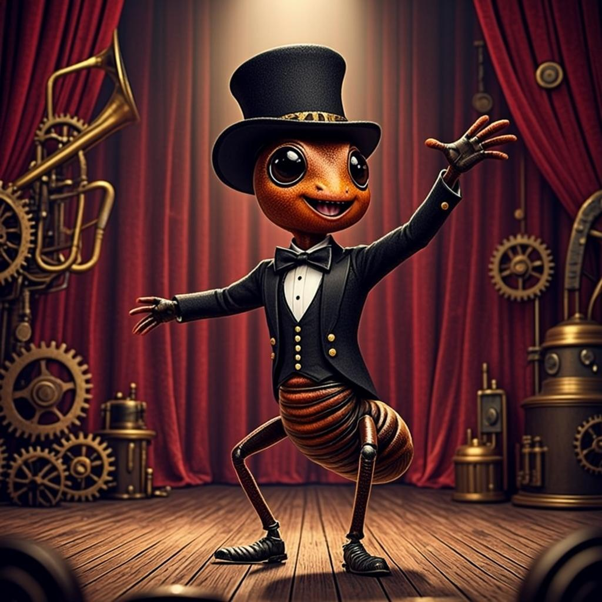

# 🐜 Relapa — Freeze Dance Game

A reaction-based freeze-dance game where **Relapa**, an anthropomorphic ant conductor, dances the floss to procedurally-generated creepy music. When the music abruptly stops — hit **SPACE** to freeze!



## 🎮 How to Play

1. Enter your name and click **Start**
2. Relapa dances to the music — watch the timer at the top
3. When the music suddenly stops, press **SPACE** (or the FREEZE button) as fast as you can
4. Don't press too early — only freeze when the music stops!
5. Build combos for score multipliers (every 3 freezes = +0.5×, up to 3×)
6. Difficulty increases each round — reaction window shrinks and music gets shorter

## ✨ Features

- **Animated SVG character** — Relapa the ant conductor with a full floss dance animation (CSS keyframes, not images)
- **Procedural music** — creepy music-box melody synthesized in real-time via Web Audio API (no copyrighted audio)
- **Progressive difficulty** — reaction window shrinks 120ms per round, music shortens with rounds
- **Combo system** — consecutive freezes build a multiplier (up to ×3)
- **Perfect-freeze bonus** — freeze early in the window for "PERFECT!" (×1.5) or "Good!" (×1.2) bonus
- **12 achievements** — milestones for combos, dance time, rounds, score, and perfect freezes
- **Daily Challenge** — seeded RNG gives all players the same sequence per day
- **Leaderboard** — top 20 scores persisted in SQLite, with All/Today filter tabs
- **Personal best** — tracked in localStorage, highlighted in leaderboard
- **Session stats** — lifetime games/freezes/dance-seconds in sidebar
- **Character skins** — (removed, papaya only now)
- **Volume control** — live slider with custom amber thumb
- **Pause** — P or Esc to pause mid-game
- **Onboarding tutorial** — first-play overlay with 5 step cards
- **3-2-1 countdown** — anticipation before each game starts
- **Screen shake + freeze flash** — visual impact when music stops
- **Confetti** — celebrates milestones and top-3 finishes
- **Round history** — timeline of each freeze's timing on game-over
- **Best reaction bar** — tracks your fastest freeze timing
- **Share score** — copy/share results to clipboard
- **Keyboard shortcuts** — D (daily), P/Esc (pause), Enter (start)
- **Mobile support** — tap-to-freeze button for touch devices
- **Responsive design** — works on mobile and desktop

## 🛠 Tech Stack

- **Next.js 16** with App Router
- **TypeScript 5**
- **Tailwind CSS 4** with shadcn/ui components
- **Prisma ORM** with SQLite
- **Framer Motion** for animations
- **Web Audio API** for procedural music synthesis
- **Lucide React** for icons

## 🚀 Getting Started

```bash
# Install dependencies
bun install

# Set up the database
bun run db:push

# Start the dev server
bun run dev
```

Open [http://localhost:3000](http://localhost:3000) to play!

## 📁 Project Structure

```
src/
├── app/
│   ├── api/leaderboard/route.ts   # Leaderboard API (GET/POST)
│   ├── globals.css                # Global styles + floss keyframes
│   ├── layout.tsx                 # Root layout
│   └── page.tsx                   # Main page
├── components/
│   ├── papaya-character.tsx       # Animated SVG Relapa character
│   ├── papaya-game.tsx            # Main game component
│   └── ui/                        # shadcn/ui components
└── lib/
    ├── achievements.ts            # Achievement definitions + helpers
    ├── db.ts                      # Prisma client
    └── music.ts                   # Web Audio music engine
```

## 🎨 Character Design

Relapa is an anthropomorphic ant conductor with:
- Warm amber-brown exoskeleton (CSS variable gradients)
- Large compound eyes with highlights
- Segmented antennae
- Top hat with musical note (♪) and burgundy band
- Burgundy bow tie
- Tailored dark suit with gold buttons
- Animated floss dance (body splits into upper/lower halves for counter-motion)

## 📝 License

MIT
